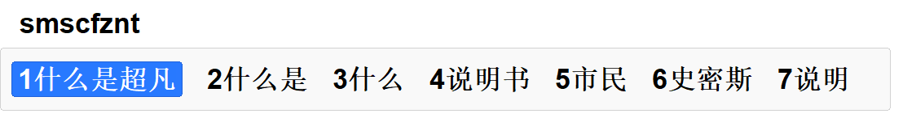
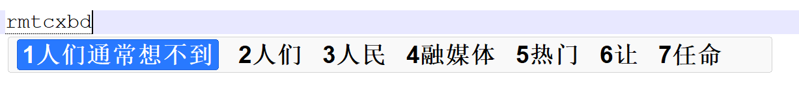
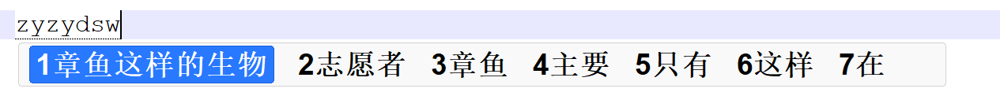
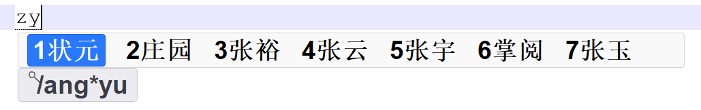
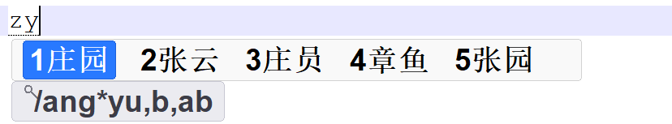

#  章鱼拼音输入法

## 易用、高效、智能的拼音输入法

章鱼拼音输入法首创拼音首字母输入，并结合 AI 技术，让输入更少、输出更准，用的越多，越懂你。

>> 下载安装： 打开Microsoft Store, 搜索"章鱼拼音输入法"。 或者访问 [下载链接](https://aka.ms/AA10oyei) 。

## 快速入门

输入内容：

什么是超凡智能体，人们通常想不到章鱼这样的生物。

按键：`smscfznt`，选择“什么是”、选择“超凡”、选择“智能体”。

按键：`rmtcxbd`，选择“人们”、选择“通常”、选择“想不到”。

按键：`zyzydsw`，选择“章鱼”、选择“这样的”、选择“生物”。

## 使用“/”筛选

候选词语非常多的时候，可以按下 `/` 进行筛选，减少翻页。筛选条件可以包含 `*` 进行模糊匹配， 例如： `/ang*yu` ，筛选全拼包含`ang`和`yu`的词语，`庄园`、`状元`、`章鱼`等词语满足要求。

还可以使用更多的搜索条件，使用逗号分割。语法为 `/条件1,条件2,条件3` 。 `条件2`是筛选词语的长度，可以输入`a~c`，表示长度`1~3`的词语。 `条件3`是筛选词语的声调，可以输入`a~e`，表示一声、二声、三声、四声和轻声的词语。 例如： `/ang*yu,b,ab`，筛选全拼包含`ang`和`yu`，长度为2，声调为一声和二声的词语，`庄园`、`章鱼`等词语满足要求。

## 常用按键

- `Space / 1-9`：选择候选词语。
- `=、下箭头、PageDown`：下一页。
- `-、上箭头、PageUp`：上一页。
- `]、右箭头`：向右移动。
- `[、左箭头`：向左移动。
- `Shift`：切换中英文。英文模式输入半角，中文模式输入全角。
- `i`：获取帮助。

## 标点和特殊符号输入对照表

| 按键 | 输入字符 | 说明 |
| --- | --- | --- |
| ` | ｀，à，á，ǎ，ā 等 | 反引号和注音字母 |
| ~ | ～，０，１，２ 等 | 波浪号和全角数字 |
| ! | ！ | |
| ＠ | @ | |
| # | ＃ | |
| $ | ￥ | |
| % | ％ | |
| ^ | ……，… | 省略号 |
| & | ＆ | |
| * | × | |
| ( | （ | |
| ) | ） | |
| - | －，--，- | 破折号、连字号 |
| _ | ＿ | |
| = | ＝ | |
| + | + | |
| [ | 【 | |
| { | ｛ | |
| ] | 】 | |
| } | ｝ | |
| \\ | 、 | |
| \| | \| | |
| ; | ； | |
| : | ： | |
| ‘ | ‘，’，ａ，ｂ 等 | 单引号和全角小写字母 |
| “ | “，”，Ａ，Ｂ 等 | 双引号和全角大写字母 |
| , | ， | |
| < | 《 | |
| . | 。 | |
| > | 》 | |
| ? | ？ | |
| / | ／，＼，· | 斜杠、全角空格等 |
| u | 兙，兡，嗧 等 | 没有拼音的生僻字 |

